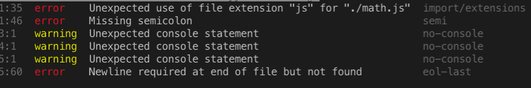

This is the second part of a 2-series article in which I talk about setting up a NodeJS project. The [first article](https://biblicalph.github.io/journal/es6-modules-in-nodejs.html){:target="_blank"} focused on using ES6 modules in NodeJS. This article dives into enforcing a consistent code format and style in a NodeJS project.

## Why Enforce a Code Format and Style?
In any project, private or public, with more than one contributor, misunderstandings are likely to occur over how code should be formatted and generally written. This is why it is important to define a coding style and format at the very start of a project. To define a coding style, you use a linter.

> A linter refers to a tool that analyzes source code to flag programming errors, bugs, stylistic errors and suspicious constructs - [Wikipedia](https://en.wikipedia.org/wiki/Lint_(software)){:target="_blank"}

You can read more about the benefits of linting in [does linting make you a better developer](https://medium.com/chingu/does-linting-make-you-a-better-developer-c9c0f382aaf0){:target="_blank"} and [why you should always use a linter](https://medium.com/dailyjs/why-you-should-always-use-a-linter-and-or-pretty-formatter-bb5471115a76){:target="_blank"}.

## Setting Up a Linter
We'll be setting up [eslint](https://eslint.org/){:target="_blank"}, a linting utility for Javascript, for the project started in the first part of this article. 
Eslint allows you to define a set of rules to enforce a coding style and format. For our purposes, we will be using the [Airbnb style guide](https://github.com/airbnb/javascript){:target="_blank"}, a set of rules defined and used by the Airbnb team. The Airbnb guide is comprehensive and covers everything from variable declarations to functions and control flow statements. Let's begin.

1. Install eslint
```
npm install eslint eslint-plugin-import --save-dev
```
2. Create a `.eslintrc.js` file, the eslint configuration file, with the following content. Note: the configuration file can be a [javascript, json or yaml](https://eslint.org/docs/user-guide/configuring){:target="_blank"} file.

`.eslintrc.js`
```
module.exports = {
  env: {
    // allow NodeJs global variables and NodeJS scoping
    node: true,
    // allow use of ES6 globals such as Set
    es6: true
  },
  parserOptions: {
    // allow use of object rest/spread properties as well as other ES8 features
    ecmaVersion: 2018,
    // allow use of Ecmascript modules
    sourceType: "module"
  }
}
```
3. Create a `.eslintignore` file with the following content. 

`.eslintignore`
```
dist/
node_modules/
```
This file tells eslint to not lint files in the `dist` and `node_modules` directory. This is important because `dist` contains the output of babel compilation and we didn't write any of the code in the `node_modules` directory.

4. Add lint commands to `package.json`
```
...
scripts: {
  ...,
  "lint": "eslint **/*.js",
  "lint:fix": "npm run lint -- --fix"
}
```
The `lint` command runs the linter and reports any errors found. The `lint:fix` command runs the linter and fixes all errors that don't require an intervention from you - example, adding missing semicolons.
Note: eslint comes with a default set of rules which are used when we run lint. Instead of using the eslint defaults, let's use the Airbnb style guide.

5. Install [Airbnb's rules for eslint](https://github.com/airbnb/javascript){:target="_blank"}
```
npm install eslint-config-airbnb-base
```
6. Add the Airbnb config to the plugins (rules) checked by eslint
`.eslintrc.js`
```
extends: ["airbnb-base"]
```
7. Run `npm run lint`. You should get an error saying eslint is unable to understand import/export syntax. To fix this, install the import plugin
```
npm install eslint-import-plugin --save-dev
```
`npm run lint` should now work as expected; it displays a list of errors as shown below:



We have successfully set up a linter for our project. Every contributor can run the lint commands to either lint or fix lint errors. At this point, we can configure our continuous integration (CI) pipeline to run the lint command. This will help us report lint errors before a pull request gets merged.

Even though we have done well so far, we can do more to make local development for individual contributors much easier. 
We can automate running of the linter such that a contributor can afford to "forget" manually running it. This way, even if a contributor forgets to lint, the linter is automatically run allowing him/her to attend to lint errors instead of waiting a while to be notified by the CI. We'll automate this by setting up Git hooks.

## Setting Up Git Hooks
1. Install [husky](https://www.npmjs.com/package/husky){:target="_blank"}, a module for managing git hooks in NodeJS
```
npm install husky--save-dev
```
2. Install [lint-staged](https://www.npmjs.com/package/lint-staged){:target="_blank"}, a module for running linters against staged git files
```
npm install lint-staged --save-dev
```
3. Configure husky and lint-staged to run lint by adding the following to `package.json`
```
  "husky": {
    "hooks": {
      "pre-commit": "lint-staged",
      "pre-push": "npm run lint"
    }
  },
  "lint-staged": {
    "{src|test}/**/*.js": [
      "npm run lint:fix",
      "git add"
    ]
  }
```
Anytime a contributor attempts to commit changes, the linter is run to fix all lint errors (those that can be fixed without intervention) before the files are  committed. Similarly, prior to pushing up a branch, the linter is run and any lint errors are reported to the contributor.

## Bonus
We have done a great job so far in terms of enforcing a consistent coding style and format. However, let's do a little more to make it easier to enforce consistent code formatting. Meet [prettier](https://prettier.io/docs/en/index.html){:target="_blank"}, an opinionated code formatter that takes the burden off the developer as relates to code formatting. We'll use prettier to ensure that code is properly formatted before it is pushed to the main repo.

1. Install prettier
`npm install prettier --save-dev`
2. Install prettier plugins for eslint. See [integrating prettier with eslint](https://prettier.io/docs/en/eslint.html){:target="_blank"} for details
```
npm install eslint-plugin-prettier eslint-config-prettier --save-dev
```
3. Add prettier to eslint config
```
extends: ["airbnb-base", "plugin:prettier/recommended"]
```

Prettier will now be run each time you run `npm run lint:fix`. Since lint fix is run prior to each commit, you can be sure that prettier will always be invoked to format your code.

Congratulations on making it to the end of this article. I hope you have enjoyed yourself as much as I. At this point, your `package.json`, `.eslintrc.js` and `.eslintignore` files should be looking as below (exact package versions may differ). Be sure to consult these files in case you missed anytime. Until next time, cheers.

`package.json` 
```json
{
  "name": "es6-modules-app",
  "version": "1.0.0",
  "description": "",
  "main": "index.js",
  "scripts": {
    "test": "echo \"Error: no test specified\" && exit 1",
    "build": "babel src -d dist",
    "start": "node dist/index.js",
    "start:dev": "nodemon src/index.js --exec babel-node",
    "lint": "eslint **/*.js",
    "lint:fix": "npm run lint -- --fix"
  },
  "keywords": [],
  "author": "",
  "license": "ISC",
  "devDependencies": {
    "@babel/cli": "^7.2.3",
    "@babel/core": "^7.2.2",
    "@babel/node": "^7.2.2",
    "@babel/preset-env": "^7.2.3",
    "eslint": "^5.12.0",
    "eslint-config-airbnb-base": "^13.1.0",
    "eslint-config-prettier": "^3.3.0",
    "eslint-plugin-import": "^2.14.0",
    "eslint-plugin-prettier": "^3.0.1",
    "husky": "^1.3.1",
    "lint-staged": "^8.1.0",
    "nodemon": "^1.18.9",
    "prettier": "^1.15.3"
  },
  "husky": {
    "hooks": {
      "pre-commit": "lint-staged",
      "pre-push": "npm run lint"
    }
  },
  "lint-staged": {
    "{src|test}/**/*.js": [
      "npm run lint:fix",
      "git add"
    ]
  }
}
```
`.eslintrc.js`
```js
module.exports = {
    "env": {
        "es6": true,
        "node": true
    },
    "extends": ["airbnb-base", "plugin:prettier/recommended"],
    "parserOptions": {
        "ecmaVersion": 2018,
        "sourceType": "module"
    }
};
```
`.eslintignore`
```
dist/
node_modules/
```