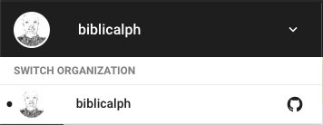
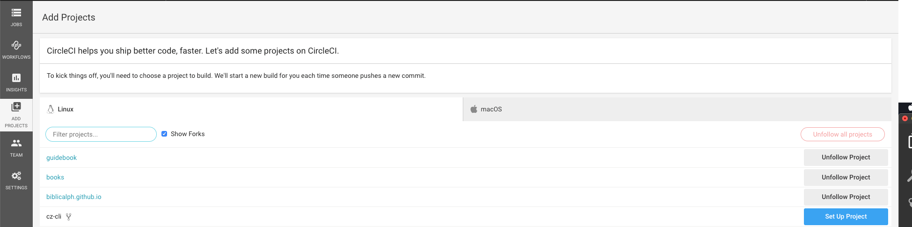
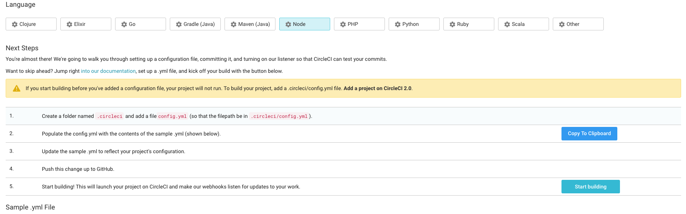
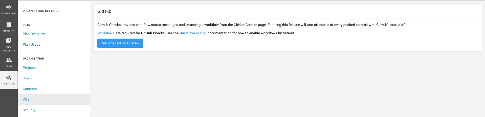
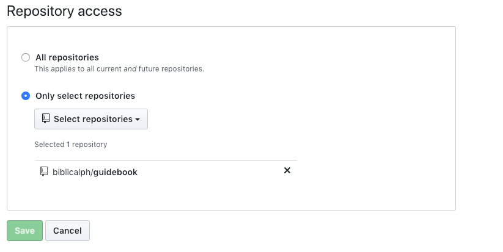

In this article, I'll explain:
1. What continuous integration is 
2. Why I set it up for [guidebook](https://github.com/biblicalph/guidebook){:target="_blank"}, a project I started to share my thoughts on building [NodeJS](https://nodejs.org){:target="_blank"} applications
3. How to setup continuous integration using [Circle CI](https://circleci.com){:target="_blank"}

## What is Continuous Integration (Definition)?
Continuous integration, also known as CI, is the process of automating the building and testing of code as developers merge changes into a central shared repository, usually, several times a day. 
See [Microsoft's definition](https://docs.microsoft.com/en-us/azure/devops/learn/what-is-continuous-integration){:target="_blank"} and [Thoughtwork's definition](https://www.thoughtworks.com/continuous-integration){:target="_blank"}

## Why Continuous Integration (Benefits)?
One of the major benefits of continuous integration is early detection of errors. The automated build process, which includes execution of automated tests, helps to identify any issues - incompatible changes, and failing tests, etc - before a set of changes are merged to the main branch (usually called `master` branch) . For [guidebook](https://github.com/biblicalph/guidebook){:target="_blank"}, using a CI ensures that broken code is not merged into the `master` branch.
You can learn more about the benefits of CI in [Azure's article](https://docs.microsoft.com/en-us/azure/devops/learn/what-is-continuous-integration){:target="_blank"} and [Thoughtwork's article](https://www.thoughtworks.com/continuous-integration){:target="_blank"}

## How to Setup Continuous Integration Using Circle CI
In this section, I'll describe how to setup continuous integration (CI) using [Circle CI](https://circleci.com){:target="_blank"}. It is, however, worth mentioning that alternatives to [Circle CI](https://circleci.com){:target="_blank"} exist for setting up continuous integration. They include [Jenkins](https://jenkins.io/){:target="_blank"}, [Travis CI](https://travis-ci.org/){:target="_blank"}, and [Codeship](https://codeship.com/){:target="_blank"}, etc.

To setup CI using [Circle CI](https://circleci.com){:target="_blank"},

1. Create a `.circleci` directory in the root directory of your git repository
2. Create a `config.yml` file in the `.circleci` directory. 
  `config.yml` is a [yaml](https://en.wikipedia.org/wiki/YAML){:target="_blank"} file that instructs Circle CI on how to setup and build your project.
3. Add the configuration instructions to the `config.yml` file. Below is the config file for [guidebook](https://github.com/biblicalph/guidebook){:target="_blank"}.   Circle CI can be configured to run multiple sequentially or in parallel, run jobs on specific branches or at scheduled intervals and deploy code automatically to staging or production servers (continuous delivery, the subject of another post).  Visit Circle CI's [configuration reference](https://circleci.com/docs/2.0/configuration-reference/#workflows){:target="_blank"} to learn more.
4. Commit the changes and push to the remote/shared version control host
5. [Create an account](https://circleci.com/signup/){:target="_blank"} on Circle CI. Both [Github](https://github.com){:target="_blank"} and [Bitbucket](https://bitbucket.org){:target="_blank"} signup options are offered by Circle CI
6. Select projects from your account for which you want to setup CI. If you are cannot find the project you want to select, make sure the correct account is selected in Circle CI. At the top left corner, select the desired account as shown in the image below:

7. Click the add projects link in the side menu, search for the desired project and click setup

8. Scroll down and click the start building button

## Bonus
Manually triggering a build from Circle CI's dashboard each time you push changes to your central version control host is not ideal and defeats the purpose of CI. Instead, it is better to configure Circle CI to automatically build your project each time changes are pushed to the version control host. 
In this section, I'll explain how to setup Circle CI to automatically trigger builds for projects hosted on Github. Kindly note that a similar thing can be done for Bitbucket and other hosts.

1. Click the settings link in the side menu of Circle CI

2. If you are not already logged in to Github, login when prompted.
3. Scroll to the bottom of the page and select the list of repositories for which you want to authorize checks

Congratulations! You have successfully setup continuous integration for your project using Circle CI.

## Next Steps
In a follow-on article, I'll explain how continuous delivery and how to set it up using Circle CI. 

## Summary
In this article, I have explained what continuous integration is, what its' benefits are and how to set it up using Circle CI.

Many thanks for following along. Until next time.

